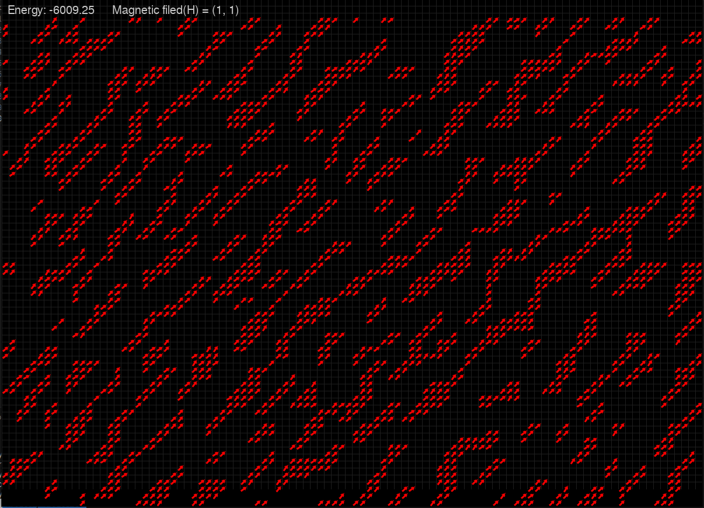

# Magnetic Dipole Simulation

A Monte Carlo simulation of dipolar magnetic particles on a 2D toroidal grid with real-time Pygame visualization.

The interaction energy of magnetic field $H$ with dipole is given by 
```math
E_{DH} = - m_i \cdot H
```
The dipole dipole interaction is given by 

```math
 E_{DD} = \frac{\mu_0}{4\pi r_{ji}^3} \left( m_i\cdot m_j\right) - 3 (r_i \cdot \vec{r}_{ji} ) (r_j \cdot \vec{r}_{ji} )

```
Where $ m_i, m_j $ are the dipole moments of two particles. $ r_{ji} $ is the unit vector drawn from particle $i$ to $j$ and $r_{ji}$ is the distance.





## Features

- 2D grid of magnetic particles
- Monte Carlo simulation with Metropolis criterion
- Pygame-based animation of particle motion

## Structure

- `grid.py` — Simulation logic (dipoles, energy, movement)
- `animator.py` — Visualization with Pygame
- `config.py` — Simulation parameters
- `main.py` — Entry point
- `assets/` — Folder for the images

## Requirements

- Python 3.x
- `pygame`, `numpy`

```bash
pip install pygame numpy